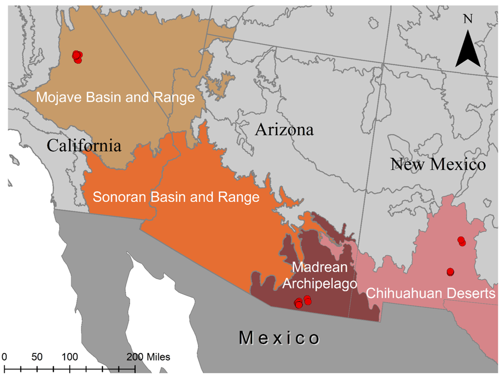

# Southwest Desert Metacommunities
## Metacommunity structure and functioning of aquatic insect metacommunities in the American Southwest, 2012-2014

[For more information, please visit the Lytle Lab website](https://lytlelab.science.oregonstate.edu)

The goal of this project is to examine aquatic insect metacommunities in three deserts:

1. The Chihuahuan Desert: White Sands, NM
	1.San Andres Canyon 
	1. Ash Canyon 

2. The Sonoran Desert: For Huachuca, AZ
	1. Huachuca Canyon 
	1. Garden Canyon 

3. The Mojave Desert: China Lake, CA
	1. Water Canyon 
	1. Great Falls Basin 

## Study Area
 

<a href="https://github.com/SouthwestDesertMetacommunities%22%3E

  </a>

All code for this project is public. 

### Data included in the Privat-MetacommunityData repository
* Electrical Resistance sensor data
* Aquatic Insect community data

