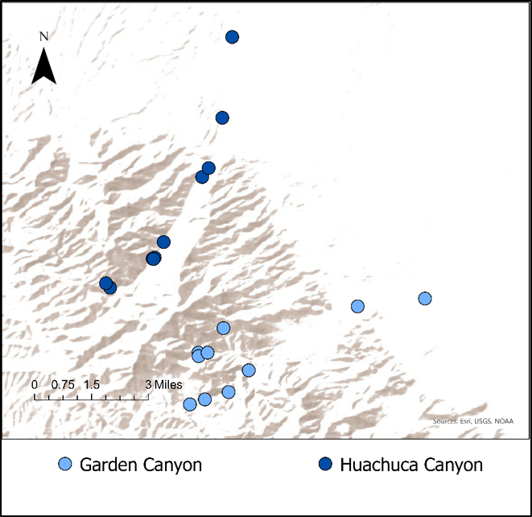
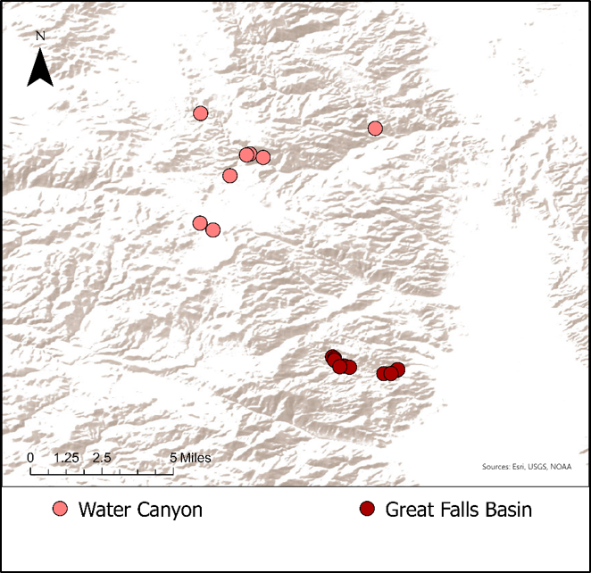
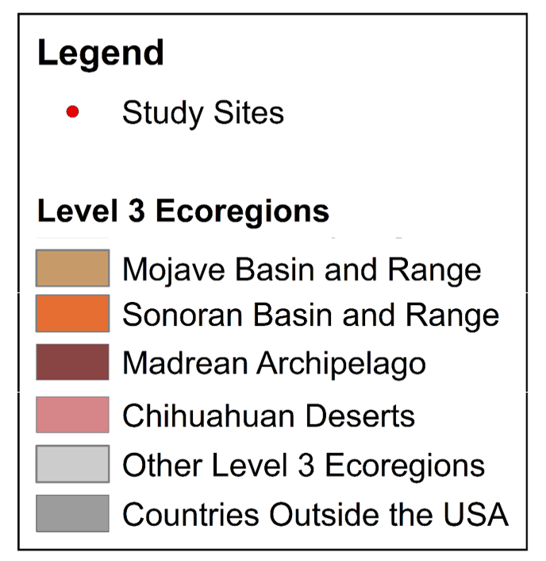

# Southwest Desert Metacommunities
## Metacommunity structure and functioning of aquatic insect metacommunities in the American Southwest, 2012-2014

[For more information, please visit the Lytle Lab website](https://lytlelab.science.oregonstate.edu)

The goal of this project is to examine aquatic insect metacommunities in three deserts:

1. The Chihuahuan Desert: White Sands, NM
	1.San Andres Canyon (sites = 2)
	1. Ash Canyon (sites = 4)

2. The Sonoran Desert: For Huachuca, AZ
	1. Huachuca Canyon (sites = 7)
	1. Garden Canyon (sites = 7)

3. The Mojave Desert: China Lake, CA
	1. Water Canyon (sites = 4)
	1. Great Falls Basin (sites = 4)

## Study Area

All code for this project is public. 

### Data included in the Prive-MetacommunityData repository
* Electrical Resistance sensor data
* Aquatic Insect community data

